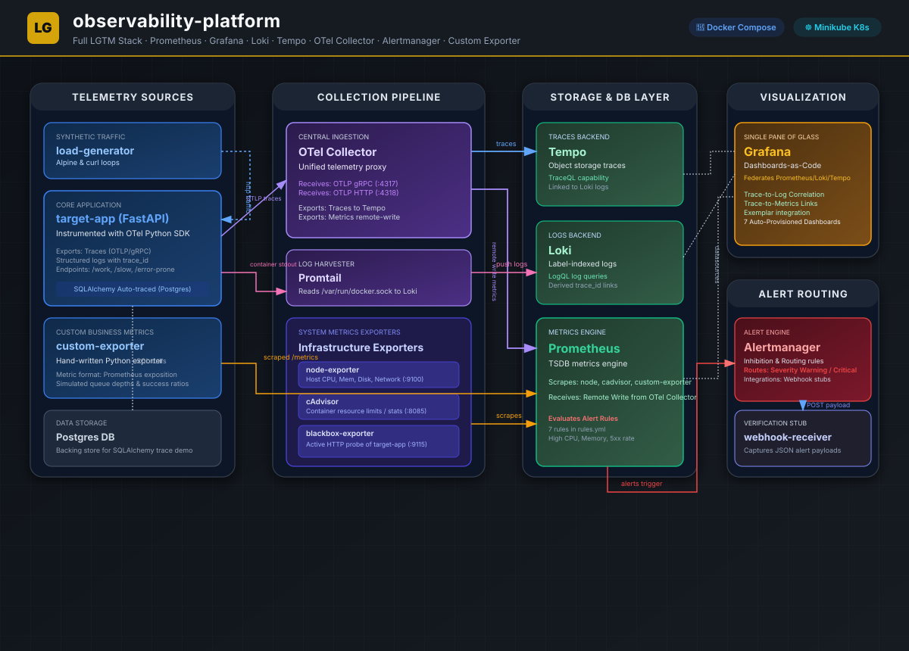

# observability-platform

[](https://grafana.com/)
[](https://prometheus.io/)
[](https://kubernetes.io/)
[](https://helm.sh/)

A standalone, production-grade observability platform demonstrating end-to-end collection, storage, correlation, and alerting of metrics, logs, and traces (LGTM stack). Deployed via Docker Compose and Kubernetes.

Rather than consuming pre-existing monitoring services, this project builds and provisions the entire telemetry pipeline from scratch, including a custom business metrics exporter, trace-to-log correlation, Alertmanager routing with noise inhibition, and dashboards-as-code.

---

## Highlights

- Full LGTM stack (Loki, Grafana, Tempo, Prometheus) provisioned with vendor-neutral OpenTelemetry Collector
- End-to-end trace-to-log correlation: click any Loki log line to jump to the matching Tempo trace waterfall
- Custom Python Prometheus exporter simulating real-world business metrics (queue depth, webhook success rates, active sessions)
- 7 Grafana dashboards-as-code auto-provisioned on startup via JSON declarations — zero manual UI configuration
- Alertmanager routing engine with multi-severity webhook dispatch and noise inhibition rules
- Dual deployment targets: 14-container Docker Compose stack for local dev and Helm v3 / K8s manifests for Kubernetes

---

## Architecture



### Data & Telemetry Flows
1. **Metrics Pipeline:**
   - **Infrastructure:** `node-exporter` ships host-level metrics; `cAdvisor` ships per-container resource metrics to Prometheus.
   - **Endpoints:** `blackbox-exporter` probes `target-app` endpoints and reports success/latency.
   - **Custom App:** `custom-exporter` simulates Postgres queries, exposes `/metrics` in Prometheus exposition format.
   - **Auto-instrumentation:** `target-app` pushes telemetry to `otel-collector`, which remote-writes metrics back to Prometheus.
2. **Logs Pipeline:**
   - `promtail` listens on the host Docker socket `/var/run/docker.sock`, auto-discovers all containers, and ships stdout/stderr to `Loki` with compose labels.
3. **Traces Pipeline:**
   - `target-app` runs OpenTelemetry Python SDK, generating spans (including SQL trace via SQLAlchemy) which ship to `otel-collector` -> `Tempo`.
4. **Correlation:**
   - **Trace ⇄ Log:** Tempo trace views contain direct links to Loki log streams matching the active `trace_id`.
   - **Trace ⇄ Metrics:** Tempo correlates tracing windows back to Prometheus resource metrics.

---

## Tech Stack

| Layer | Technology | Purpose |
|---|---|---|
| **Metrics** | Prometheus v2.53.0 | Metrics aggregation TSDB + alerting rule evaluation engine |
| **Logs** | Loki 3.1.0 + Promtail 3.1.0 | Log collection agent and log storage aggregation backend |
| **Traces** | Tempo 2.5.0 | High-scale distributed tracing backend |
| **Routing** | OpenTelemetry Collector 0.104.0 | Telemetry proxy (OTLP grpc/http receiver → Tempo/Loki/Prometheus) |
| **Alerting** | Alertmanager v0.27.0 | Alert routing, grouping, silencing, and multi-severity webhook delivery |
| **Exporters** | node-exporter, cAdvisor, blackbox-exporter | Host, container, and active HTTP probe exporters |
| **Custom Exporter** | Python (FastAPI + `prometheus_client`) | Business metric simulator (Active users, queue depths, webhook success) |
| **Target App** | Python (FastAPI + SQLAlchemy + OTel SDK) | Instrumented multi-endpoint service creating traces/logs/metrics |
| **Visualization** | Grafana 11.1.0 | Single pane of glass dashboards with native cross-datasource linking |
| **Deployment** | Docker Compose, Helm v3, Kubernetes (minikube) | Dual-target local development and cluster deployment models |

---

## Repository Structure

```
observability-platform/
├── docker-compose/
│   ├── docker-compose.yml
│   ├── .env.example
│   └── configs/             # Core configs for Prometheus, Loki, Tempo, AM, OTel, Promtail
├── kubernetes/
│   ├── manifests/           # Raw Kubernetes deployments (Postgres, custom services, RBAC)
│   └── helm-values/         # Value overrides for kube-prometheus-stack, Loki, and Tempo
├── dashboards/              # 7 Grafana Dashboards provisioned as code (JSON format)
├── alert-rules/             # Prometheus alert rule definitions (rules.yml)
├── custom-exporter/         # Code + Dockerfile for the custom Prometheus business metrics exporter
├── target-app/              # Code + Dockerfile for instrumented FastAPI test app
├── webhook-receiver/        # Mock HTTP target verifying Alertmanager routing payload
├── docs/
│   ├── architecture.md      # Detailed data-flow breakdown
│   ├── runbooks/            # Alert response runbooks (1 per alert rule)
│   └── evidence/            # Evidence checklists and screenshot directories
└── README.md
```

---

## Key Implementation Decisions

* **Grafana Dashboards-as-Code:** 
  Dashboards are fully declared as JSON in the `/dashboards` directory and auto-provisioned on startup via Grafana's `/etc/grafana/provisioning` configuration. This guarantees portability and configuration reliability across staging environments without manual UI setup.
* **Trace-to-Log Correlation:**
  The `target-app` logs are formatted to include `trace_id` metadata. In Grafana, the Loki datasource is provisioned with `derivedFields` matching `trace_id=(\w+)`. This allows clicking a log line to immediately load the corresponding Tempo trace waterfall in a split pane.
* **Webhook Receiver Stub:**
  To verify routing without third-party API dependencies (Slack/PagerDuty) in development, a FastAPI `webhook-receiver` acts as a target stub. When alerts transition to `firing` or `resolved`, the payload is written in-memory and exposed via `/received` for easy browser validation.
* **Alert Noise Inhibition:**
  Configured Alertmanager inhibition rules suppress warning-level alerts when a critical alert for the same component/instance is already firing. For example, if a node's CPU usage is critical (`HostHighCPU`), warning-level application latency alerts (`AppHighLatency`) are muted to prevent alert fatigue.

---

## Local Development (Docker Compose)

### Prerequisites
- Docker Engine or Docker Desktop
- Host ports free: `3000`, `8000`, `8085`, `8090`, `9090`, `9093`, `9100`, `9115`, `9200`

### 1. Initialize Stack
Clone and navigate to the docker-compose folder:
```bash
cd docker-compose
cp .env.example .env
docker compose up -d --build
```
This builds custom images and spins up all 14 services.

### 2. Verify Data Flow
- **Prometheus Targets:** `http://localhost:9090/targets` (confirm all targets show `UP`)
- **FastAPI Target App:** `http://localhost:8000/docs` (endpoints `/work`, `/slow`, `/error-prone` receive traffic via background `load-generator`)
- **Grafana UI:** `http://localhost:3000` (Login: `admin`, password set via `.env`)
  - Go to **Dashboards** to view the 7 preloaded dashboards.

---

## Kubernetes Deployment (Minikube)

Production-ready manifests and Helm charts are provided for cluster-level deployment.

### 1. Set Up Cluster
Start minikube and enable the Ingress addon:
```bash
minikube start --cpus=6 --memory=8g
minikube addons enable ingress
```
*Note: StatefulSets for Prometheus and Loki require sufficient cluster resources. A minimum of 6 vCPUs is recommended.*

### 2. Load Local Images
Direct your terminal to the minikube daemon and build images:
```bash
eval $(minikube docker-env)
docker build -t target-app:local ./target-app
docker build -t custom-exporter:local ./custom-exporter
docker build -t webhook-receiver:local ./webhook-receiver
```

### 3. Deploy Stack
Apply namespace and core manifests:
```bash
kubectl apply -f kubernetes/manifests/00-namespace.yaml
kubectl apply -f kubernetes/manifests/
```

Deploy the Helm releases:
```bash
helm repo add prometheus-community https://prometheus-community.github.io/helm-charts
helm repo add grafana https://grafana.github.io/helm-charts
helm repo update

# Install prometheus stack (admission webhooks disabled — not required for single-node clusters)
helm install kube-prometheus-stack prometheus-community/kube-prometheus-stack \
  -n observability \
  -f kubernetes/helm-values/kube-prometheus-stack-values.yaml \
  --set prometheusOperator.admissionWebhooks.enabled=false \
  --set prometheusOperator.admissionWebhooks.patch.enabled=false \
  --set prometheusOperator.tls.enabled=false

# Install Loki log aggregator
helm install loki grafana/loki-stack \
  -n observability \
  -f kubernetes/helm-values/loki-stack-values.yaml

# Install Tempo distributed tracing
helm install tempo grafana/tempo \
  -n observability \
  -f kubernetes/helm-values/tempo-values.yaml
```

---

## Verification & Evidence

Full step-by-step validation procedures for metrics, logs, traces, custom exporters, and alert routing are documented in [TESTING-GUIDE.md](TESTING-GUIDE.md).

---

## Lessons Learned

- **OTel Semantic Convention Changes:** OpenTelemetry metrics libraries can change metric names across versions (e.g. `http_server_duration_seconds` vs `http_server_requests_total`). Checking raw Prometheus labels via `/api/v1/label/__name__/values` is the fastest debugging step before building dashboards.
- **Docker Socket Mounts:** Promtail's auto-discovery via `/var/run/docker.sock` requires the socket to be explicitly shared with the container. Verify this in your Docker engine settings if log ingestion is not working.
- **Liveness Probes Under Resource Pressure:** Under heavy scheduling load, liveness probe intervals can timeout before a pod's initialization completes, triggering unnecessary container restarts. Setting realistic resource requests and conservative startup probe delays prevents cascading restarts.

---

*Built by [cypher682](https://github.com/cypher682)*
