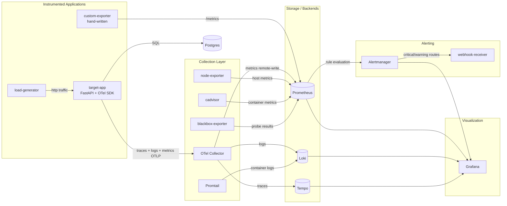

# Architecture

## Data Flow Diagram

## Component Responsibilities

| Layer | Component | Role |
|---|---|---|
| App | target-app | Instrumented FastAPI service — generates real metrics/logs/traces |
| App | custom-exporter | Hand-written exporter — business metrics (users, jobs, webhooks) |
| App | load-generator | Keeps target-app under continuous synthetic traffic |
| Collection | OTel Collector | Single ingestion point — fans traces/logs/metrics out to Tempo/Loki/Prometheus |
| Collection | Promtail | Ships container stdout/stderr to Loki |
| Collection | node-exporter | Host-level metrics (CPU, memory, disk, network) |
| Collection | cadvisor | Per-container resource metrics |
| Collection | blackbox-exporter | Active HTTP/TCP/DNS probing of endpoints |
| Storage | Prometheus | Metrics TSDB + alert rule evaluation |
| Storage | Loki | Log aggregation, indexed by label not full text |
| Storage | Tempo | Trace storage + service graph generation |
| Alerting | Alertmanager | Routes/groups/silences/inhibits alerts |
| Alerting | webhook-receiver | Stub endpoint proving routing works end-to-end |
| Viz | Grafana | Unified dashboards across all three pillars + correlation |

## Correlation Paths (why this counts as a unified platform, not 3 separate tools)

- **Trace → Logs**: Tempo's `tracesToLogsV2` config lets you click from a
  span directly into the matching Loki log lines for that trace_id.
- **Trace → Metrics**: Tempo's `tracesToMetrics` links a span to the
  Prometheus metrics for that service/time window.
- **Logs → Trace**: Loki's `derivedFields` regex-extracts `trace_id=...`
  from target-app's structured logs and links back to the Tempo trace.
- **Metrics → Trace (exemplars)**: Prometheus datasource's
  `exemplarTraceIdDestinations` links a metric data point to the specific
  trace that produced it, when exemplars are present.

## Why HTTP-only / local-state design choices carry over conceptually here

D1 has no cloud dependency (unlike F3), but the same engineering
discipline applies: bounded retention (7-15d) instead of unbounded
storage, resource limits on every container/pod, and a clear teardown
story (`docker compose down -v` / `helm uninstall` + `minikube delete`)
so this can be spun up fresh for evidence capture without leftover state
skewing dashboards.
